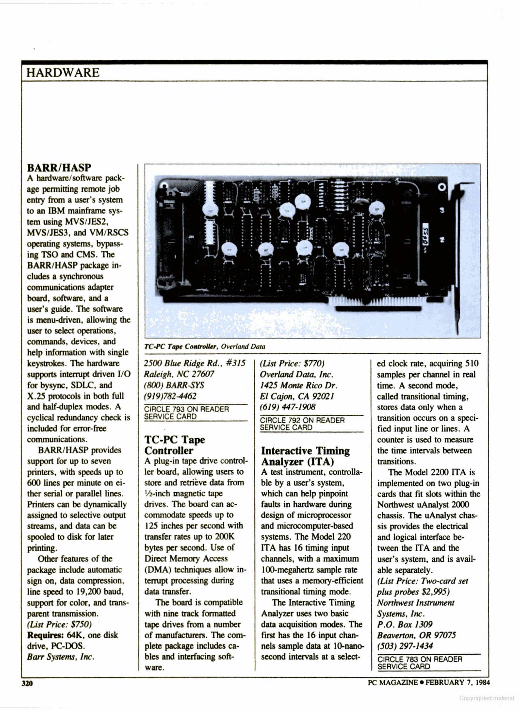

# Introduction
This repository will contain all data about the Northwest Instruments System Inc. uAnalyst 200 state timing analyzer. Partially a collection of data from the internet, some thoughts of my own, partialy reverse engineering of some elements.

Advertisement from PC-MAG 1994/2

# Hardware Details
The hardware consists of a mainframe case with 8 slots for measurement cards. In the mainframe there are also 3 power supplies (2x15V connected in series to get +15V and -15V and +5V). The mainframe is connected to a PC via an 8-bit ISA card. 

* [ISA interface card](isa_card/README.md)
* [21-006-00 PC interface](mainframe_cards/21-006-00_pc_interface/README.md)
* [21-013-00 C-2101 State Analyzer Controller](mainframe_cards/21-013-00_C-2101_state_analyzer_controller/README.md)
* [21-026-00 32 Channel Memory Board](mainframe_cards/21-026-00_32_channel_memory_board/README.md)
* [21-020-00 ITA Trigger Board/](mainframe_cards/21-020-00_ITA_trigger_board/README.md)
* [ITA Memory Board](mainframe_cards/ITA_memory_board/README.md)

There existed also a 003 Option Time Stamp Board and a 16 Channel Memory Board, none of which I own. On the timestamp there is a Manual in the Manuals section.

# PC Requirements
The manual states an IBM PC (TM) is required which implies an 8088 CPU. And you need a mainboard with a ISA slot :) Mainstream boards went up to Pentium III and Socket A AMD Athlon/Duron, but there were also mainboards manufactured for Pentium 4. I have made a connection from a Pentium 166 MMX without problems. Also, the timing analyzer requires a CGA graphics mode (640x200, 2 colors - here black and white) which not all modern VGA cards emulate well. I tried a SiS 6326 (integrated in an Socket 7 mainboard) and a Matrox Mystique which gave a bit shaky display in the graphics mode. A S3 Virge gives a nice clear picture. Only the waveforms are displayed in the graphics mode, everything else is text only, so in that mode every card is ok. 

# Software
Software runs under DOS and has very little memory requirements (256KB or 512KB). I also tried FreeDOS - no problem. It can also run under the command line window in Windows 95/98, however due to the text/graphic mode switching it is quite annoying (Windows can display the graphics mode in a window, but each switch text->graphics mode switches back to fullscreen.
The software has also printing capabilities, one can print to LPT1-LPT3 and COM1-2 but also to a file (raw printer data is saved). The printer data contains an ESC/P code, which can be easily converted these days to something modern (using e.g. [PrinterToPDF](https://github.com/RWAP/PrinterToPDF/))
