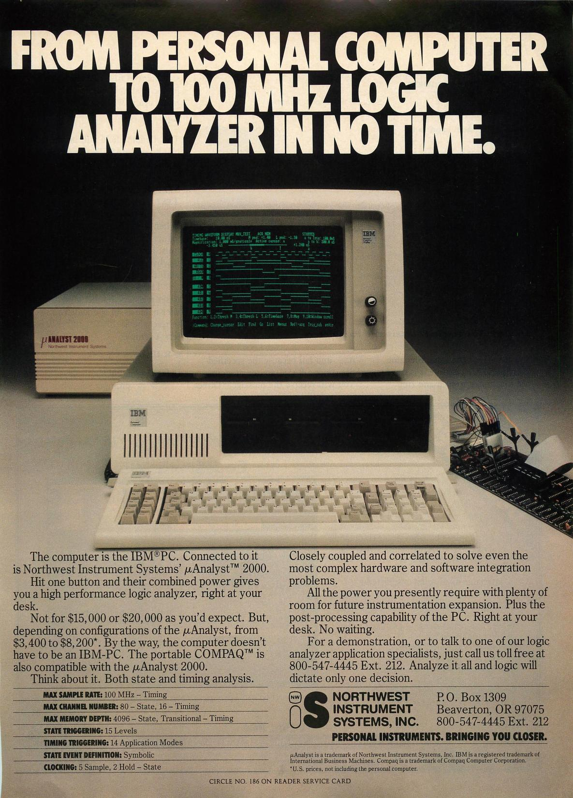
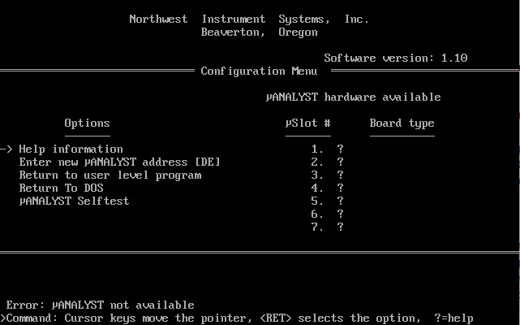

# Introduction
This repository will contain all data about the Northwest Instruments System Inc. μAnalyst 2000 state and timing analyzer. Partially a collection of data from the internet, some thoughts of my own, partialy reverse engineering of some elements.

\
Advertisement from PC Tech Journal vol01 n06

# Manuals
* [μAnalyst 2000_Model 2100 Interactive State Analyzer Operators Manual](manuals/uAnalyst_2000_Model_2100_Interactive_State_Analyzer_Operators_Manual_198601.pdf)
* [μAnalyst 2100 Interactive State Analyzer Users Manual](manuals/uAnalyst_2100_Interactive_State_Analyzer_Users_Manual_Jan85.pdf)
* [μAnalyst 2200 Interactive Timing Analyzer Users Manual](manuals/uAnalyst_2200_Interactive_Timing_Analyzer_Users_Manual_Jan85.pdf)
* [μAnalyst Time Stamp_Option 003](manuals/uAnalyst_Time_Stamp_Option_003_1985.pdf)
* [μAnalyst Z80DISA Disassembler](manuals/uAnalyst_Z80DISA_Disassembler_1985.pdf)

Please take note, that the Z80DISA is not a special mainframe card, from the hardware side it is a microprocessor probe which is in fact just a convinient way to connect the state analyzer probes to a Z80 microprocessor + a configuration file for the basis software. All manuals are from the [bitsavers.org](https://bitsavers.org/test_equipment/northwestInstrument/) website.

# Hardware Details
The hardware consists of a mainframe case in which the main part is a backplane with 8 slots for measurement cards. In the mainframe case there are also 3 power supplies (2x15V connected in series to get +15V and -15V and +5V). The +5V power supply seems to have "remote" voltage sensing for better regulation. Also, there is a second "+5V" rail in the mainframe board: it is additionally filtered via an LC filter located on the mainframe board. In the case there is also a mains distribution board and below it there is a EMC filter. The mainframe is connected to a PC via an 8-bit ISA card. 

* [ISA interface card](isa_card/README.md)
* [21-006-00 PC interface](mainframe_cards/21-006-00_pc_interface/README.md)
* [21-013-00 C-2101 State Analyzer Controller](mainframe_cards/21-013-00_C-2101_state_analyzer_controller/README.md)
* [21-026-00 32 Channel Memory Board](mainframe_cards/21-026-00_32_channel_memory_board/README.md)
* [21-020-00 ITA Trigger Board/](mainframe_cards/21-020-00_ITA_trigger_board/README.md)
* [ITA Memory Board](mainframe_cards/ITA_memory_board/README.md)

There existed also a 003 Option Time Stamp Board and a 16 Channel Memory Board, none of which I own. On the timestamp there is a Manual in the Manuals section.

# PC Requirements
The manual states an IBM PC (TM) is required which implies an 8088 CPU. And you need a mainboard with a ISA slot :) Mainstream mainboards went up to Intel Pentium III (Socket 350) and AMD Athlon/Duron (Socket A), but there were also industrial mainboards manufactured for Pentium 4. I have made a connection from a Pentium 166 MMX without problems (which lets me think that the hardware and software is well designed, so it should also work on a P4). As for RAM the manual says 256KB or 512KB (dependant on the amount of floppy drives :) )\
Also, the timing analyzer requires a CGA graphics mode (640x200, 2 colors - here black and white), which not all modern VGA cards emulate well. I tried a SiS 6326 (integrated on a Socket 7 mainboard) and a Matrox Mystique which gave a bit shaky display in the graphics mode. A S3 Virge gave a nice clear picture. Only the waveforms (from the timing analyzer) are displayed in the graphics mode, everything else is text only, so in that mode every card is ok. 

# Software
Unfortunatelly the μAnalyst 2000 which I aquired came with a 5,25" disk, which showed files only during the first read, after an unsuccessfull copy do the hard disk the floppy stopped showing any content. I tried to do a backup via greaseweazle, but it seems that some of the sectors are not readable... Luckily some people made a backup:\
[Software v1.1](software/analyst_2000_1.1.zip) (from [bitsavers.org](https://bitsavers.org/test_equipment/northwestInstrument/))\
And since currently we are not limited by the 5,25" floppy sizes, here a version all in one, ready to start from a hard disk or floppy (one could even put the files to a bootdisk, all together 500kB):
[Single folder μAnalyst software](software/ANALYZE_single.zip)

On the help disk (or my single folder) there is also a program called P2DOS.EXE which seem to be a file converter from UCSD p-System (apparently there was such a thing [link](https://en.wikipedia.org/wiki/UCSD_Pascal)). There is one executable UANALYZE.EXE, for all possible functions.

Software runs under DOS, DOS 2.0 is required (doesn't say of MS-DOS or other). I have run the program on MS-DOS 7.1 (Command Prompt only boot option for Windows 98), from Windows 98 itself and FreeDOS - in every case it runs fine. Running from the command line window in Windows 95/98 is fine, however due to the text/graphic mode switching it is quite annoying (Windows can display the graphics mode in a window, but each switch text->graphics mode switches back to fullscreen.\
The software has also printing capabilities, one can print to LPT1-LPT3 and COM1-2 but also to a file (raw printer data is saved). The printer data contains an ESC/P code, which can be easily converted these days to something modern like PDF (using e.g. [PrinterToPDF](https://github.com/RWAP/PrinterToPDF/))

\
This is how the startup screen looks like (screenshot from Dosbox, so no cards are being detected). Please note, that there is a \mu character being shown. If on your system there is a different character, then you have the wrong codepage (should be 437).
